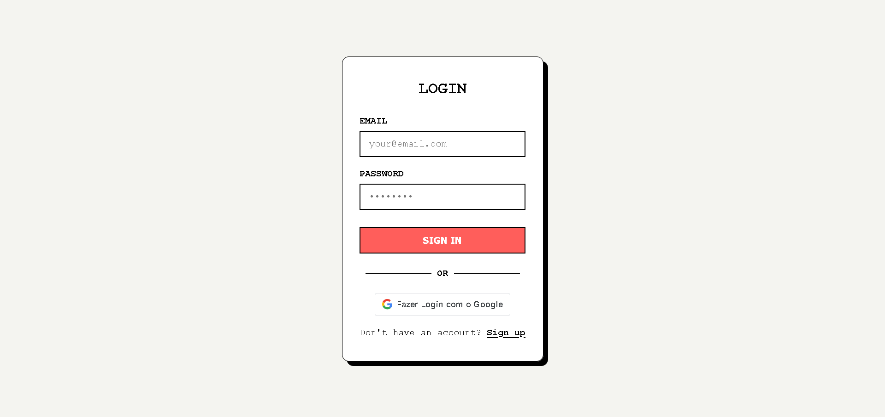
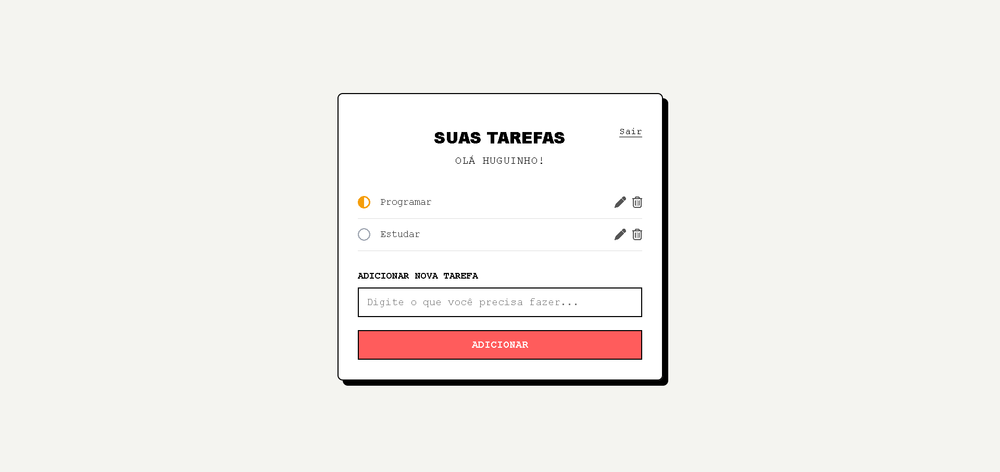

<h1 align="center">
  📝 React To-Do List
</h1>

<p align="center">
  Uma aplicação web moderna, responsiva e completa para gerenciamento de tarefas desenvolvida com <b>React 19</b>, <b>Vite</b>, <b>Google OAuth</b> e <b>CSS Modules</b>.
</p>

<p align="center">
  <a href="https://todo-list-gamma-snowy-20.vercel.app/" target="_blank">
    
  </a>
</p>

<p align="center">
  
  
  
  
  
  
</p>

<!-- SEÇÃO DE PREVIEW / DEMONSTRAÇÃO DO PROJETO -->
<p align="center">
  
  <br /><br />
  
</p>

---

## 📌 Índice

- [Visão Geral](#-visão-geral)
- [Funcionalidades](#-funcionalidades)
- [Destaques Técnicos](#-destaques-técnicos)
- [Tecnologias Utilizadas](#-tecnologias-utilizadas)
- [Estrutura de Pastas](#-estrutura-de-pastas)
- [Como Executar o Projeto](#-como-executar-o-projeto)
- [Scripts Disponíveis](#-scripts-disponíveis)
- [Autor](#-autor)

---

## 📖 Visão Geral

> 🔗 **Acesse a aplicação rodando online:** [https://todo-list-gamma-snowy-20.vercel.app/](https://todo-list-gamma-snowy-20.vercel.app/)

O **React To-Do List** é uma aplicação web moderna e intuitiva para organização e gerenciamento de tarefas diárias. Desenvolvida como uma Single Page Application (SPA), a ferramenta oferece sistema completo de autenticação de usuários (via formulário padrão e login social com **Google OAuth 2.0**), rotas protegidas e um dashboard interativo para controle total do ciclo de vida das tarefas (criação, edição inline, gerenciamento de status e exclusão).

---

## ✨ Funcionalidades

- 🔑 **Autenticação de Usuários:** Suporte para cadastro e login com e-mail/senha ou autenticação rápida via **Google OAuth 2.0**.
- 🛡️ **Proteção de Rotas:** Rota `/dashboard` protegida com verificação de sessão ativa via `ProtectedRoute`, redirecionando acessos não autorizados para a tela inicial.
- 📋 **Gerenciamento Completo de Tarefas (CRUD):**
  - ➕ **Adição de Tarefas:** Criação rápida de novas tarefas com validação no front-end.
  - ✏️ **Edição Inline:** Permite editar a descrição de qualquer tarefa diretamente na lista (tecla `Enter` para salvar e `Esc` para cancelar).
  - 🔄 **Controle de Status Dinâmico:** Alternância intuitiva entre os status *Pendente*, *Em andamento* e *Concluída* com feedback visual via cores e ícones do FontAwesome.
  - 🗑️ **Exclusão de Tarefas:** Remoção simplificada de tarefas concluídas ou desnecessárias.
- 🎨 **Interface Responsiva e Elegante:** Layout estilizado com CSS Modules e ícones FontAwesome, garantindo excelente experiência visual em dispositivos móveis e desktops.
- 🚪 **Encerramento de Sessão (Logout):** Encerramento seguro da sessão do usuário com remoção dos dados armazenados no `sessionStorage`.

---

## ⚡ Destaques Técnicos

1. **Autenticação Social com Google OAuth (`@react-oauth/google`):** Integração com o SDK do Google para autenticação segura e obtenção de credenciais do usuário.
2. **Rotas Protegidas no React Router v7:** Implementação do componente `ProtectedRoute` no `React Router Dom` para resguardar o acesso à página principal de tarefas.
3. **Estilização Modular com CSS Modules:** Separação de estilos escopados por componente (`Login.module.css` e `Dashboard.module.css`), evitando conflito de seletores globais.
4. **Comunicação REST Assíncrona:** Integração com backend remoto via `fetch()` utilizando `credentials: 'include'` para envio/recebimento seguro de sessão.
5. **Vite 8:** Utilizado como ferramenta de build para tempo de inicialização rápido, recarregamento de módulo instantâneo (HMR) e empacotamento otimizado.

---

## 🛠️ Tecnologias Utilizadas

| Tecnologia | Descrição |
| :--- | :--- |
| **[React 19](https://react.dev/)** | Biblioteca para construção da interface de usuário em componentes |
| **[Vite](https://vitejs.dev/)** | Build tool rápida para desenvolvimento Front-End moderno |
| **[React Router Dom](https://reactrouter.com/)** | Gerenciamento de rotas e navegação |
| **[@react-oauth/google](https://www.npmjs.com/package/@react-oauth/google)** | Biblioteca para autenticação com Google OAuth 2.0 |
| **JavaScript (ES6+)** | Lógica de programação principal |
| **CSS Modules** | Estilização escopada e customizada por componente |
| **FontAwesome** | Biblioteca de ícones interativos |

---

## 📁 Estrutura de Pastas

```text
React_ToDo-List/
├── public/
│   ├── favicon.webp            # Favicon da aplicação
│   ├── preview_login.png       # Screenshot da tela de Login
│   └── preview_dashboard.png   # Screenshot da tela de Dashboard
├── src/
│   ├── components/        # Componentes reutilizáveis do React
│   │   ├── Dashboard.jsx        # Componente e lógica do painel de tarefas
│   │   ├── Dashboard.module.css # Estilos exclusivos do Dashboard
│   │   ├── Login.jsx            # Componente de Login/Registro e Google OAuth
│   │   └── Login.module.css     # Estilos exclusivos do Login
│   ├── App.jsx            # Roteamento e proteção de rotas
│   ├── index.css          # Estilos globais e reset CSS
│   └── main.jsx           # Ponto de entrada com GoogleOAuthProvider
├── .env                   # Variáveis de ambiente da aplicação
├── eslint.config.js       # Configurações do ESLint
├── index.html             # HTML5 com inclusão do FontAwesome
├── package.json           # Dependências e scripts do projeto
├── vercel.json            # Configuração de rotas para deploy na Vercel
└── vite.config.js         # Configurações do Vite
```

---

## 🚀 Como Executar o Projeto

### Pré-requisitos
Certifique-se de ter o **[Node.js](https://nodejs.org/)** (versão 18 ou superior recomendada) e o **npm** instalados na sua máquina.

### Configuração das Variáveis de Ambiente
Crie um arquivo `.env` na raiz do projeto com as seguintes variáveis:

```env
VITE_API_URL=https://sua-api.com
VITE_GOOGLE_CLIENT_ID=seu_google_client_id.apps.googleusercontent.com
```

### Passo a passo

1. **Clonar o repositório:**
   ```bash
   git clone https://github.com/MrHuguitos/React_ToDo-List.git
   ```

2. **Acessar a pasta do projeto:**
   ```bash
   cd React_ToDo-List
   ```

3. **Instalar as dependências:**
   ```bash
   npm install
   ```

4. **Executar a aplicação no modo de desenvolvimento:**
   ```bash
   npm run dev
   ```

5. **Abrir no navegador:**  
   Acesse a URL exibida no terminal (geralmente `http://localhost:5173`).

---

## ⚙️ Scripts Disponíveis

No repositório do projeto, você pode executar:

- `npm run dev`: Inicia o servidor local de desenvolvimento com Vite.
- `npm run build`: Cria a versão de produção otimizada na pasta `dist`.
- `npm run preview`: Executa visualização local do build de produção.
- `npm run lint`: Executa a verificação de código com ESLint.

---

## 👨‍💻 Autor

Desenvolvido por **Hugo Araujo** ([@MrHuguitos](https://github.com/MrHuguitos)).

Se você gostou deste projeto, sinta-se à vontade para deixar uma ⭐️ no repositório!